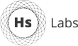

---
featured:
  - Enumeration
  - Tarantino
  - Naak
  - hsbot
  - HeadspringTime
  - bulk-writer
  - Ferdinand
  - OptionalWCF
  - HeadspringWebAccessibility
blogs:
  - scichelli: http://feeds.feedburner.com/lostechies/gwc
  - ChrisMissal: http://feeds.feedburner.com/ChrisMissalsBlog
  - seanbiefeld: http://lostechies.com/seanbiefeld/feed/
  - ryanande: http://www.flapstack.com/rss/
  - plioi: http://lostechies.com/patricklioi/feed/
  - gbHeadspring: http://glennburnside.com/rss
  - davidsavagejr: http://kemahshore.com/atom.xml
  - pmcvtm: http://loudandabrasive.com/rss/
  - derans: http://feeds.feedburner.com/derans
---

<head>
    <meta charset="utf-8"/>
    <meta name="viewport" content="width=device-width, initial-scale=1"/>
    <meta name="description" content="Headspring Labs"/>
    <meta name="author" content="Headspring"/>
    <title>Headspring Labs</title>
    <link rel="stylesheet" href="static/dist/vendor.css">
    <link rel="stylesheet" href="http://fonts.googleapis.com/css?family=Open+Sans:400,300,600,700" type="text/css"/>
    <!--[if lt IE 9]>
    
    
    <![endif]-->
</head>
<body>
<!-- begin preloader -->

    

        

            <i class="fa fa-cog fa-3x fa-spin"></i>
        

    

<!-- end preloader -->

<!-- begin nav -->
<nav class="navbar navbar-default navbar-fixed-top" role="navigation">
    

        

            <button type="button" class="navbar-toggle" data-toggle="collapse" data-target=".navbar-collapse">
                Toggle navigation
                Menu
            </button>
            <!-- begin logo in navigation -->
            
            <!-- end logo in navigation -->
        

        

            <ul class="nav navbar-nav pull-right">
                <!-- begin navigation items -->
                <li class="current"><a href="#intro">Start</a></li>
                <li><a href="#features">Open source</a></li>
                <li><a href="#newsletter">Questions &amp; bugs</a></li>
                <li><a href="#customers">Team members</a></li>
                <!-- end navigation items -->
            </ul>
        

    

</nav>
<!-- end nav -->

<!-- begin intro section -->
<section class="intro" id="intro">
    

        

            

                

                    <!-- begin logo intro section -->
                    
                    <!-- end logo intro section -->
                    <h1>We build software that transforms organizations</h1>
                    <a href="#" class="mouse">
                        <i class="fa fa-angle-down Drop animated"></i>
                    </a>
                

            

        

    

    

</section>
<!-- end intro section -->

<!-- begin features section -->
<section class="features" id="features">
    

        

            

                

                    <h1>Open source</h1>
                    
We build stuff. And then share it with you.

                    
                

            

        

        

            
            
            

                

                    

                        <h5 class="panel-title"><a href="{{ repo.html_url }}">{{ repo.name }}</a>
                        </h5>
                    

                    

                        
{{ repo.description }}

                    

                    

                        <iframe src="http://ghbtns.com/github-btn.html?user={{ repo.owner.login }}&amp;repo={{ repo.name }}&amp;type=watch&amp;count=true"
                                allowtransparency="true" frameborder="0" scrolling="0" width="110" height="20"></iframe>
                        <iframe src="http://ghbtns.com/github-btn.html?user={{ repo.owner.login }}&amp;repo={{ repo.name }}&amp;type=fork&amp;count=true"
                                allowtransparency="true" frameborder="0" scrolling="0" width="110" height="20"></iframe>
                    

                

            

            
            
        

    

</section>
<!-- end features section -->

<!-- begin newsletter section -->
<section class="newsletter" id="newsletter">
    

        

            

                

                    <h1>Questions &amp; bugs</h1>
                    
If you have any questions or find a bug in any of our projects, please submit an issue on GitHub for that repo.

                    
                

            

        

    

</section>
<!-- end newsletter section -->

<!-- begin customer section -->
<section class="customers" id="customers">
    

        

            

                

                
                    

                        
                    

                
                

            

        

    

</section>
<!-- end customer section -->

<!-- begin footer section -->
<footer class="footer" id="footer">
    

        

            

                <!-- begin logo footer -->
                
                <!-- end logo footer -->
                

                    We build software that transforms organizations.
                

            

            

                <h4>More Headspring</h4>
                

                <ul>
                    <li>
                        <a href="http://www.headspring.com/">Headspring.com</a>
                    </li>
                    <li>
                        <a href="http://www.headspring.com/careers">
                            Jobs
                            We're hiring!
                        </a>
                    </li>
                    <li>
                        <a href="http://www.twitter.com/Headspring">Headspring Twitter</a>
                    </li>
                    <li>
                        <a href="http://www.twitter.com/HeadspringLabs">Headspring Labs Twitter</a>
                    </li>
                </ul>
            

            

                <h4>Events</h4>
                

                <ul>
                    <li>
                        <a href="http://austingivecamp.org/">Austin GiveCamp</a>
                    </li>
                    <li>
                        <a href="http://houstongivecamp.org/">Houston GiveCamp</a>
                    </li>
                    <li>
                        <a href="http://codecamp14.adnug.org/">Austin Code Camp</a>
                    </li>
                </ul>
            

        

        

            

                
<small>Copyright &copy; 2014 Headspring Labs</small>

            

        

    

</footer>
<!-- end footer section -->



    

        

            

                <button type="button" class="close" data-dismiss="modal">&times;Close</button>
                

                    
                

                <h4 class="modal-title">{{ member.login }}</h4>
            

            

                <h4>Links</h4>
                <ul>
                    <li>
                        <a href="{{ member.html_url }}">GitHub Profile</a>
                    </li>
                </ul>
                
                
                
                <h4>Recent Blog Posts</h4>
                <ul data-blogfeed="{{ feed }}">
                </ul>
                
                
            

        

    



<!-- Javascripts -->

</body>